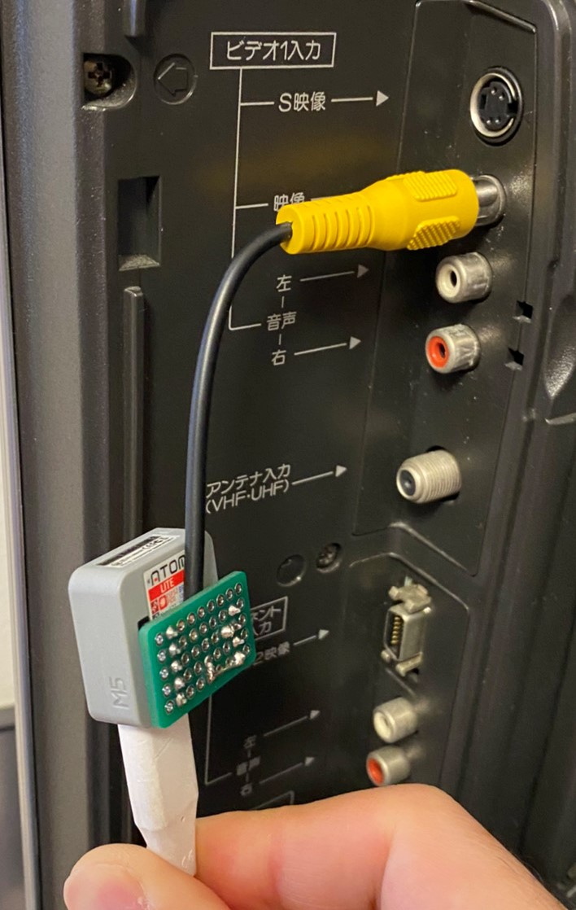

# ESP32 8BIT CVBS Library

## Outline

Composite Video, Blanking, and Sync is a signal that combines the synchronization signal, luminance signal, and in the case of color, color signal that make up the video signal, so that it can be handled by a single cable.

I have modified the [ESP_8_BIT_composite](https://github.com/Roger-random/ESP_8_BIT_composite.git) library to generate CVBS video signals and combined it with LovyanGFX. Simply put, I replaced the ESP_8_BIT_GFX class with LovyanGFX.

I have also created a Panel_CVBS class that transfers drawing data to the double buffer that the ESP_8_BIT_composite class has. You can also place this Panel_CVBS class in the LovyanGFX folder.

With these little modifications we are able to output 256x240 (480i@29.97Hz) size images to CRT and digital TVs very fast from the ESP32 module.

## Sample Videos

I posted [some sample videos](https://www.instagram.com/p/CbXvBUovzNE/?utm_source=ig_web_copy_link) on Instagram. Please take a look if you like.

## How to Install

I have made some modifications to the ESP_8_BIT_composite library, please use the source code in the riraosan repository.
```
https://github.com/riraosan/ESP_8_BIT_composite.git
```

### Arduino IDE

- Please download the following library from GitHub.

```
https://github.com/riraosan/ESP32_8BIT_CVBS.git
https://github.com/m5stack/M5GFX.git
https://github.com/riraosan/ESP_8_BIT_composite.git
```

- Please place the downloaded library in the library folder.

```powershell:Windows10
C:\Users\{{username}}\Documents\Arduino\libraries
```

### PlatformIO IDE

Please download the library from the GitHub repository using the PlatformIO IDE's library manager.

```yaml:platformio.ini
lib_deps =
        https://github.com/m5stack/M5GFX.git
        https://github.com/riraosan/ESP_8_BIT_composite.git
        https://github.com/riraosan/ESP32_8BIT_CVBS.git
```

## How to use

```cpp
//#define ENABLE_GPIO26

#include <Arduino.h>
#include <M5GFX.h>
#include <ESP32_8BIT_CVBS.h>

static ESP32_8BIT_CVBS _cvbs;
static M5Canvas        _sprite(&_cvbs);

void setup(){
  _cvbs.begin();
  //Initial configuration of other modules, etc.
}

void loop(){
  //Drawing process, etc.
  _cvbs.display(); // swapping Double Buffer
}
```

- Please create an instance of the ESP32_8BIT_CVBS class and initialize the Panel_CVBS class. ` ESP32_8BIT_CVBS _cvbs;`
- Please tie an instance of the ESP32_8BIT_CVBS class to an instance of the LGFX_Sprite class. `M5Canvas _sprite(&_cvbs);`
- Please initialize the library by executing `begin()` of the Panel_CVBS class with `setup()`.
- After that, please implement various drawing processes using M5GFX API in `loop()`.
- Please refer to the sample code for how to use M5GFX API.
- You can also place the Panel_CVBS class in the M5GFX folder (/panel). Of course, you need to include the ESP_8_BIT_composite library.
- The default composite signal output port is GPIO25.
- If you want to output composite signal from `G26` port of Grove connector (PH2.0-4P) of M5Stack ATOM Lite, please write `#include ENABLE_GPIO26` in the source code (*.ino). You should be able to switch output ports on other ESP32 module boards (unconfirmed).
- If you are using PlatformIO IDE, please add the build flag to `platformio.ini`.

```yaml
build_flags =
         -D ENABLE_GPIO26
```

### About ESP32 and RCA cable connection

A simple wiring diagram is reproduced from `README.md` of the [ESP_8_BIT](https://github.com/rossumur/esp_8_bit.git) library.

You can set video out to GPIO25 and GPIO26.

```
    -----------
    |         |
    |  25(26) |------------------> RCA(pin)
    |         |                +-> RCA(ring)
    |         |                |
    |         |                |
    |         |                |
    |  ESP32  |                |
    |         |                |
    |         |                |
    |         |                |
    |         |                |
    |         |                |
    |     GND |----------------+
    -----------
```

You connect the signal line of the RCA cable to GPIO 25 (26) and the GND shielding the outside of the RCA cable to the GND of the ESP32 module.
Then you connect the RCA cable to the yellow female connector (video) on the back of your digital TV.

- Sample Image



> In terms of shape, the male plug has a metal rod (pin) in the center and a ring-shaped metal plate with a cutout surrounding it. The female socket has a metal ring around the hole where the pin is inserted. When connected, the male ring clamps the female ring. Traditionally, a bare ring with a cutout on all sides was often used (commonly known as a "tulip"), but nowadays, a ring with only one small cutout and covered with plastic, except for a few millimeters at the tip, is the most common form.
> [Wikipedia](https://ja.wikipedia.org/wiki/RCA%E7%AB%AF%E5%AD%90)

## Testing with sample codes

I have tested using [M5Stack ATOM Lite](https://shop.m5stack.com/collections/m5-controllers/products/atom-lite-esp32-development-kit). I have not tested with other ESP32 modules or boards.

I placed some of the sample files committed to the LovyanGFX library in the sample folder. I have made some modifications to the sample files, using a panel image size of 256x240. I used these sample codes to test the Panel_CVBS class.

If you could confirm that this library could work with other ESP32 module boards, I would be happy to commit the information to this repository.

## Acknowledgments

In creating this library, I used the ideas and libraries of these giants[^1]. Thank you very much.

- Special thanks to [lovyan03](https://github.com/lovyan03), author of [LovyanGFX(M5GFX)](https://github.com/lovyan03/LovyanGFX.git).
- Special thanks to [rossumur](https://github.com/rossumur), author of [ESP_8_BIT](https://github.com/rossumur/esp_8_bit).
- Special thanks to [Roger-random](https://github.com/Roger-random), author of [ESP_8_BIT_composite](https://github.com/Roger-random/ESP_8_BIT_composite.git).

## Copyright

- ESP32_8BIT_CVBS : [MIT](https://github.com/riraosan/ESP32_8BIT_CVBS/blob/master/LICENSE) riraosan
- ESP_8_BIT_composite  : [MIT](https://github.com/Roger-random/ESP_8_BIT_composite/blob/main/LICENSE) Roger-random
- LovyanGFX : [FreeBSD](https://github.com/lovyan03/LovyanGFX/blob/master/license.txt) lovyan03
- M5GFX : [MIT](https://github.com/m5stack/M5GFX/blob/master/LICENSE) M5Stack

## Author

- [riraosan_0901](https://twitter.com/riraosan_0901) on Twitter

[^1]: > What Des-Cartes did was a good step. You have added much several ways, & especially in taking the colors of thin plates into philosophical consideration. [If I have seen further it is by standing on the shoulders of Giants](https://en.wikipedia.org/wiki/Standing_on_the_shoulders_of_giants).
`Isaac Newton` 
